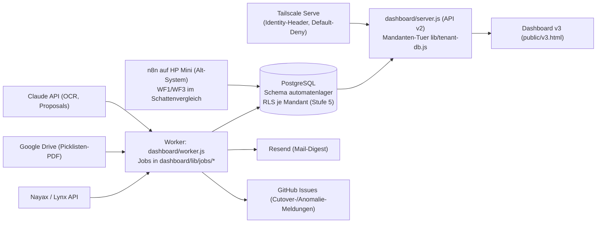

# Architektur

> Stand 2026-06-10. Detailtiefe und Historie: `HANDOVER.md`, `docs/ROADMAP.md`,
> `docs/specs/*`. Begriffe: `docs/UBIQUITOUS_LANGUAGE.md`.

## Systemueberblick

Das System ist ein mandantenfaehiges Automatenlager auf PostgreSQL (Schema
`automatenlager`) mit einem Node.js-Dashboard als Leitstand und einem
Worker-Dienst, der die frueheren n8n-Workflows als Backend-Jobs abloest
(Stufe 6). Google Sheets ist als Datenschicht **abgeloest** (SQL-only); die
Sheets-Schreibknoten in den Workflow-Exporten sind bewusst deaktiviert. n8n
laeuft als Alt-System auf dem HP Mini weiter, bis der Cutover (#198) die
letzten Schatten-Jobs (WF1/WF3) abloest.



## Schichten

| Schicht | Komponente | Verantwortung |
|---|---|---|
| Daten | PostgreSQL `automatenlager` | Einzige Wahrheit; 33+ idempotente Migrationen in `dashboard/db-migrations/`; RLS-Backstop ueber Rolle `automatenlager_app` (fail-closed, GUC `automatenlager.current_tenant`) |
| Zugriff | `dashboard/lib/tenant-db.js` (Mandanten-Tuer) | EINZIGE Lese-/Schreibschicht der App; fail-closed; `read`/`write`/`tx`; strukturell erzwungen durch `lib/query-filter-guard.js` (build-blockierend ueber die Testsuite) |
| Auth | `dashboard/lib/auth.js` + `lib/tenant-directory.js` | Default-Deny, exakte Allowlist (`DASHBOARD_ADMIN_LOGIN`), Tailscale-Header nur von vertrauenswuerdiger Quelle, Break-Glass read-only |
| API/UI | `dashboard/server.js` + `public/v3.*` | API v2 (`/api/v2/...`), Dashboard v3 Multipage, Gast = read-only |
| Jobs | `dashboard/worker.js` + `lib/jobs/*` | n8n-Abloesung (Stufe 6): Intervall-Scheduler (setInterval — node-cron ist auf dem WSL2-Mini unzuverlaessig), Telemetrie in `audit.workflow_runs`, externe HTTP-Calls mit hartem Timeout (`lib/fetch-timeout.js`) |
| Alt-System | n8n (HP Mini) + `WF*.json`-Exporte im Repo-Root | Laeuft bis Cutover #198; WF1/WF3 werden im Schatten verglichen (`lib/jobs/shadow-harness.js`, `cutover-monitor.js`) |

## Workflow-Rollen und Stufe-6-Status

| Workflow | Rolle | Stufe-6-Status |
|---|---|---|
| WF0 | Einmaliger product_slot_id-Backfill (Sheets-Aera) | obsolet, stillgelegt |
| WF1 | Rechnungseingang (PDF -> Claude-OCR -> Vorschlag) | Backend-Port `lib/jobs/invoice-intake.js`, Schattenbetrieb |
| WF2 | Produktstamm, Aliase, Lagerchargen, Rechnungsvorschlaege | n8n aktiv (Forms); Sheets-Knoten deaktiviert, schreibt SQL via WF-PGW |
| WF3 | Nayax-Verkaeufe + FIFO-Abbuchung | Backend-Port `lib/jobs/nayax-sales.js`, Schattenbetrieb, Cutover gated (#198) |
| WF4 | Aktive MDB-/Slot-Zuordnung + Historisierung | Leseseite/Trigger im Dashboard; Schreibport `lib/jobs/wf4-slot-write.js` |
| WF5 | MHD-/Bestands-Monitoring + Mail | Backend-Port `lib/jobs/wf5-monitor.js` |
| WF7 | Nachfuellung melden | Dashboard-Endpunkt (`lib/refill-apply.js`), n8n-Webhook abgeloest |
| WF8 | GuV-Tagesposten-Aggregation | Backend-Port `lib/jobs/guv-aggregate.js` (laeuft produktiv) |
| WF9 | Pickliste verarbeiten (Drive-PDF) | Backend-Port `lib/jobs/picklist.js` |
| WF-PGW / WF-Monitor / WF-Val / WF-Drift-Check / WF-Update-Check / WF-Claude-Proposals / WF-MatView-Refresh / WF-Nayax-Devices-Sync | Infrastruktur-/Hilfsworkflows | portiert (`monitor.js`, `db-validation.js`, `claude-proposals.js`, `matview-refresh.js`, `nayax-devices-sync.js`) bzw. obsolet (Drift-/Update-Check) |

## Mandantenfaehigkeit (Stufen)

- **Stufe 2 (Auth, live):** Mandanten-Registry statt Hartcodes; `resolveViewer`
  default-deny; Break-Glass `X-Support-Tenant` read-only + auditiert.
- **Stufe 3 (Lese-Isolation, live):** alle Lesepfade durch die Mandanten-Tuer
  mit `tenant_id`-Filter; Guard #107 build-blockierend.
- **Stufe 4 (Schreib-Isolation, live):** Schreibpfade durch `db.tx`
  (Parent-Pruefung + Write atomar); `tenant_id` im Request-Body => 400 + Audit.
- **Stufe 5 (RLS-Backstop, live):** Policies (USING + WITH CHECK, einarmiges
  `current_setting` => fail-closed) auf allen operativen Tabellen; App-Rolle
  `automatenlager_app` ohne BYPASSRLS; Infra-/App-Verbindungs-Split.
- **Stufe 6 (n8n-Abloesung, in Arbeit):** Jobs portiert, WF1/WF3 im Schatten;
  nach Cutover #198 verliert `n8n_app` BYPASSRLS (Migration 0033, deploy-gated).

## Fachliche Invarianten (unveraendert gueltig)

### WF2 und WF4 haben getrennte Eigentuemerschaft

WF2 (bzw. der Produktstamm-Pfad) pflegt Produktstamm, Alias, Lagercharge und
Rechnungsvorschlaege — und darf **nie** aktive Slotbelegungen (`active`,
`machine_id`, `mdb_code`, `product_slot_id`, `valid_*`) als Nebenwirkung
setzen. Sonst entstehen doppelte aktive Zeilen und falsche Slot-Historien.

### WF4-Pfad ist die einzige Wahrheit fuer aktive Slotbelegung

Aktive MDB-/Slot-Zuordnungen, `product_slot_id`, `active = TRUE/FALSE`,
`valid_from_datetime`/`valid_to_datetime`, Produkt-/MDB-Wechsel und
Produkttausch laufen ausschliesslich ueber den WF4-Pfad (heute:
`lib/jobs/wf4-slot-write.js` + Slot-Editor im Dashboard).

### `active = TRUE` bedeutet Slotbelegung, nicht Produkt-Existenz

```text
Dieses Produkt ist aktuell in einer Maschine auf einem MDB-Slot aktiv.
```

Globale Produktstammdaten existieren unabhaengig von Maschinen-/Slotdaten.

### `product_slot_id` ist historische Belegungs-ID

```text
PS_[machine_id]_[mdb_code]_[product_key]_[valid_from]
```

Die ID gehoert zur Slotbelegung, nicht zum globalen Produkt.

### Matching: ProductName fuehrend, MDB-Code Kontrollsignal

Verkaufs-Matching laeuft ueber `MachineID + ProductName`; der MDB-Code ist
Warn-/Kontrollsignal (`MDB_CODE_CHANGED_FOR_PRODUCT`), blockiert aber keinen
Verkauf. Zielbild bleibt `machine_id + mdb_code + valid_from/valid_to`.

### Keine produktive Nayax-/Moma-Aenderung

Nayax/Moma werden gelesen, nicht automatisiert beschrieben.

### Kostenbasis GuV (Kleinunternehmer)

EK = Netto-Warenwert + nicht rueckholbarer Pfand; GuV bucht bei
Kleinunternehmer-Modell **brutto** (`cost_basis`-Marker, Migrationen
0028–0030, Restatement-Runbook in `docs/specs/guv-kostenbasis-kleinunternehmer-restatement-v1.md`).

## Dashboard-Architektur

- Server: `dashboard/server.js` (Node-Bordmittel + `pg`), API v2 unter `/api/v2/...`
- Frontend: `dashboard/public/v3.html|v3.js|v3.css` (Multipage v3);
  `index.html`/`app.js` ist die Alt-Oberflaeche
- Worker: `dashboard/worker.js` (eigener Prozess/Container, `restart: always`)
- Konfiguration: `dashboard/.env.local` (nie in Git); vollstaendige
  Variablenreferenz in `dashboard/.env.example` (DB-URLs, Resend, Anthropic,
  Google Drive, Cutover-Flags, Job-Zeitplaene, Anomalie-Monitor)
- Auth: Tailscale-Serve-Header `Tailscale-User-Login`, Default-Deny,
  Gaeste read-only, Audit als JSONL unter `dashboard/logs/`

## Offen und geplant

Die geordnete Gesamtplanung liegt in `docs/ROADMAP.md` (Nordstern:
Cloudflare/Render/Supabase, n8n vollstaendig abloesen). Unmittelbar:
Cutover #198 (Schatten-Deckungsgleichheit), danach n8n-Abschaltung +
Migration 0033; anschliessend Monitoring/Off-Site-Backup und Self-Service.
